# Geometry Dash Game

Welcome to the **Geometry Dash Game**! 

## Table of Contents
- [Introduction](#introduction)
- [Features](#features)
- [Installation](#installation)
- [How to Play](#how-to-play)
- [Screenshots](#screenshots)
- [Control Instructions](#controls)

## Introduction

Geometry Dash is a fast-paced platformer game where you control a square-shaped character through various obstacles. Timing and rhythm are key as you jump, fly, and flip your way to victory. This project is built using HTML, CSS, Javascript, Typescript and Canvas API.

## Features

- **Challenging Level:** Navigate through multiple stages through a level, each with increasing difficulty.
- **Customizable Characters:** Change your character's appearance with different colors and icons.
- **Obstacle Course:** Encounter various types of obstacles including spikes, platforms, and more.
- **User Interface:** Intuitive controls and clean graphics.

## Installation

To get started with the Geometry Dash Game, follow these steps:

1. **Clone the Repository:**
   ```bash
   git clone https://github.com/ajay9803/Geometry-Dash.git

## How to Play

- **Start the Game:** Open the game in your web browser.
- **Navigate Through Obstacles:** Use the spacebar or arrow up to jump and avoid obstacles.
- **Reach the End:** Aim to complete each level without hitting any obstacles.
- **Use customized-character:** Use variety of customized characters.

## Screenshots

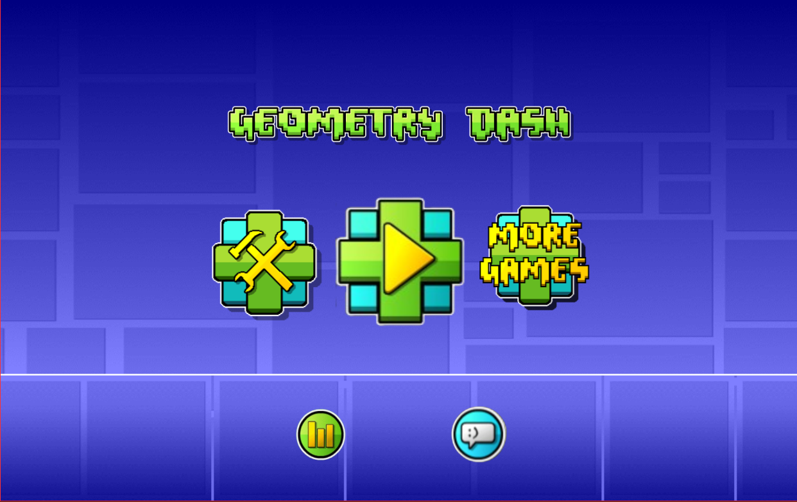 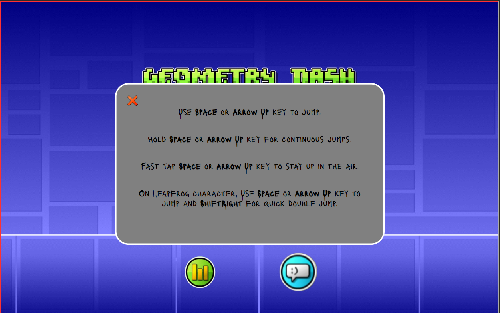 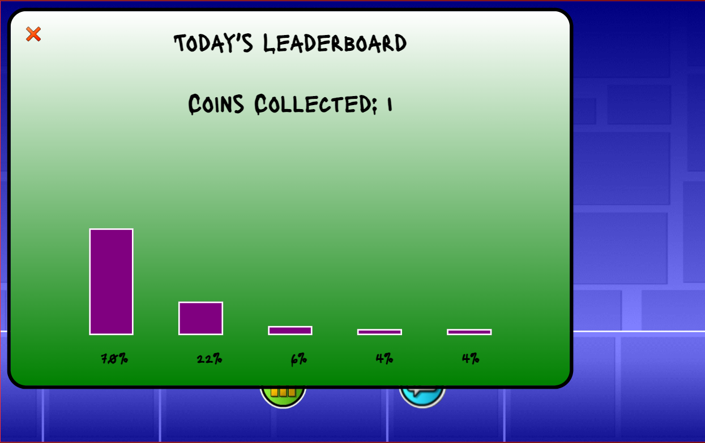 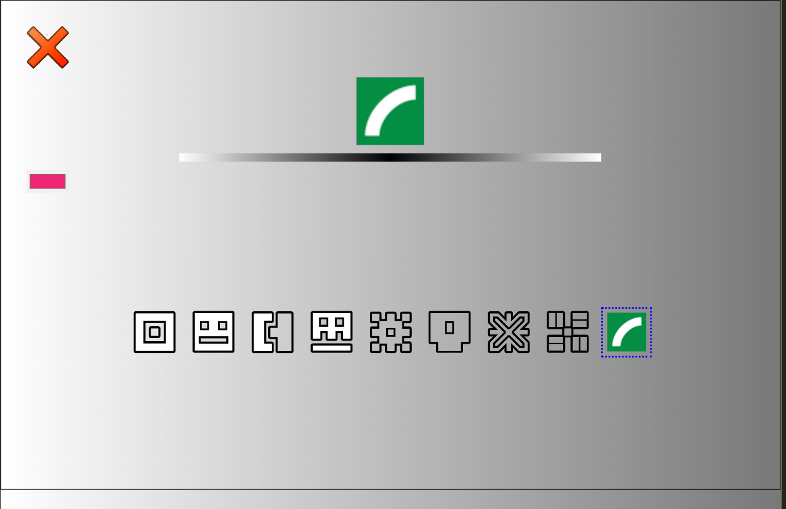  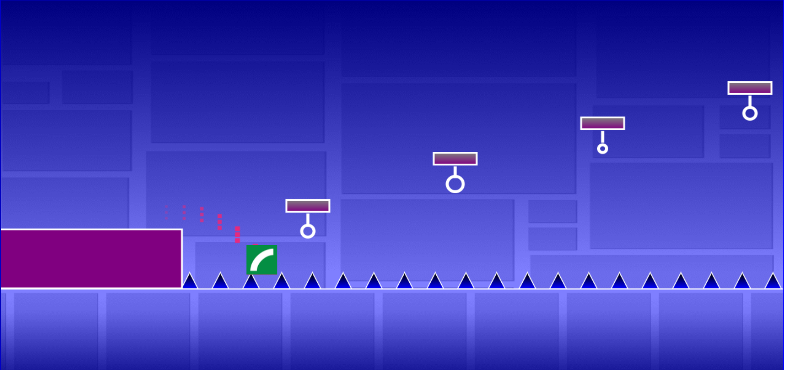 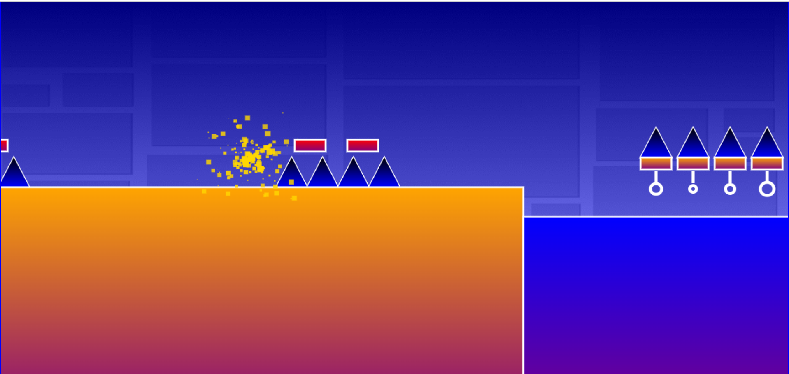 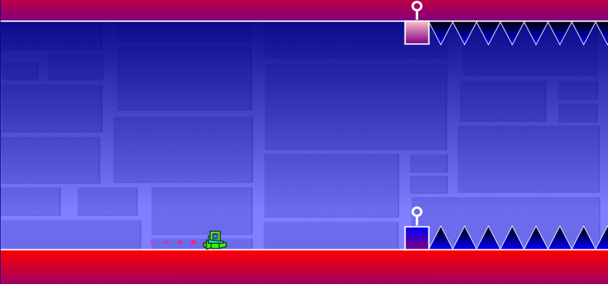 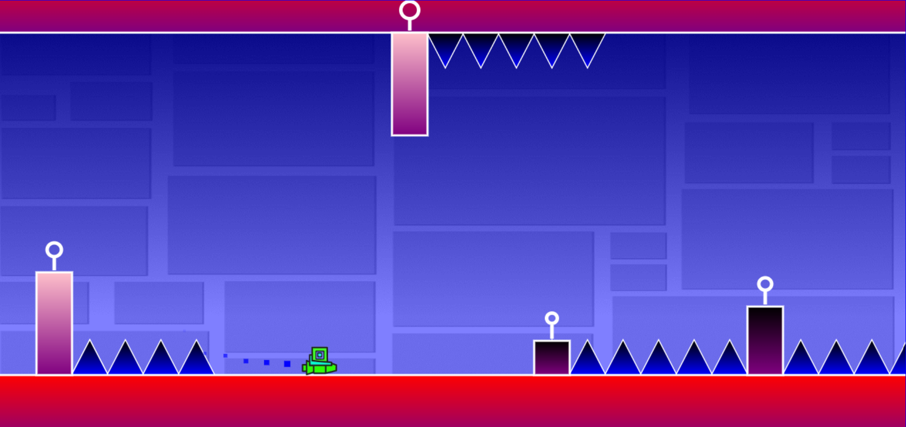  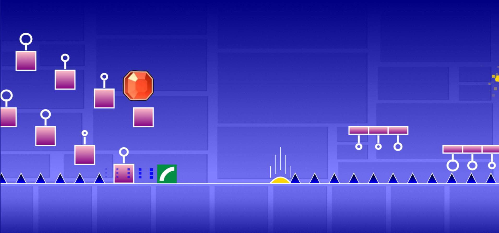  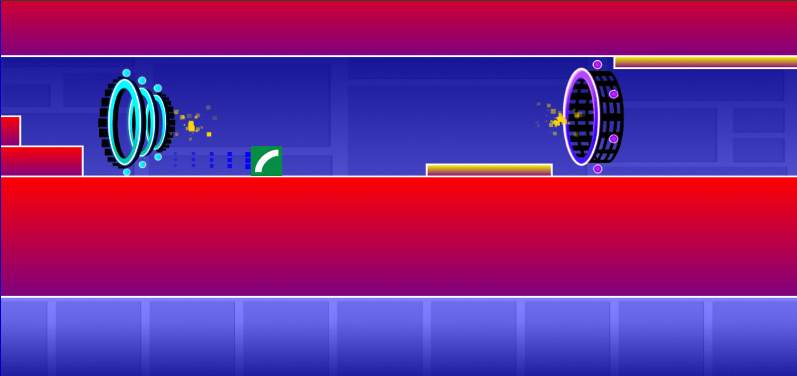 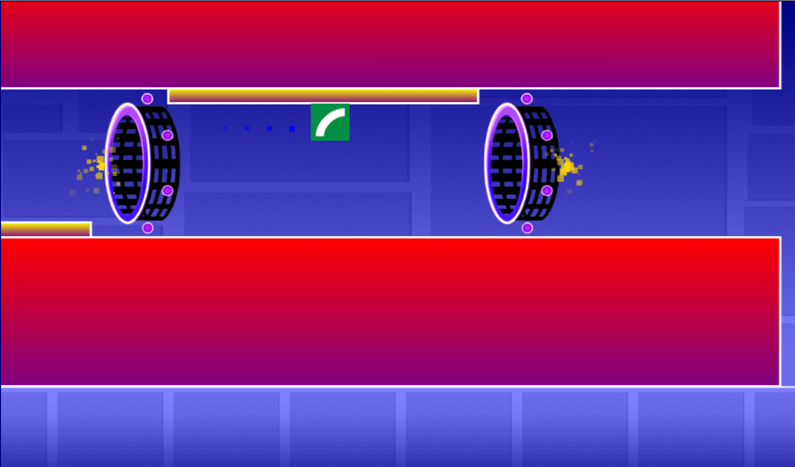

## Controls

- **Use Arrow-Up or Space to jump**
- **Hold on to Arrow-Up or Space to jump continuous obstacles**
- **Fast Tap on Arrow-Up or Space to stay up in the air**
- **For Leapfrog character, Use ShiftRight key to double jump**